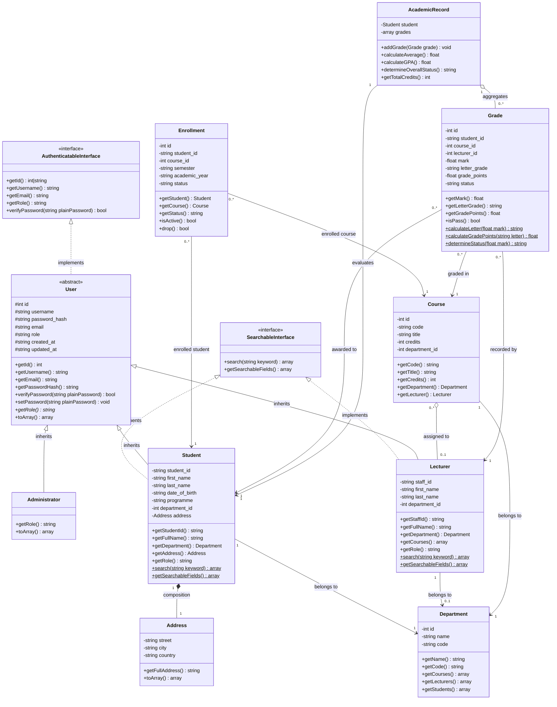

# Student Academic Management System (SAMS)
## Object-Oriented Class Design Specification

| Metadata | Details |
| :--- | :--- |
| **Project** | Student Academic Management System (SAMS) |
| **Group** | Group 1 |
| **Technology** | Object-Oriented PHP 8.2+ |
| **Document** | Detailed OOP Class Design |
| **Role** | Software Architect / OOP Designer (Member 2) |
| **Version** | 1.0 |

---

## 1. Design Overview & Architectural Principles

The **Student Academic Management System (SAMS)** is engineered using strict Object-Oriented Programming (OOP) paradigms adhering to a layered, MVC-inspired architectural pattern. The system cleanly separates responsibilities across **Presentation (Views)**, **Coordination (Controllers)**, **Domain Logic (Services)**, **Entity Persistence & Encapsulation (Models)**, and **Data Storage (PDO / Connection)**.

### Core OOP Principles Applied

1. **Encapsulation**:
   - Class properties are marked `private` or `protected` to prevent direct external manipulation.
   - Public accessor (`get*`) and mutator (`set*`) methods guard class invariants and enforce data validation.
2. **Inheritance**:
   - `User` provides a shared foundational abstract class inherited by `Administrator`, `Lecturer`, and `Student`.
   - Domain-specific exceptions inherit from `\InvalidArgumentException`, providing a specialized exception hierarchy while remaining backward compatible with general exception catch blocks.
3. **Abstraction**:
   - `User` enforces contract compliance through the abstract method `abstract public function getRole(): string`.
   - Business services hide intricate SQL queries and transactional semantics behind high-level domain operations (e.g., `$enrollmentService->enrollStudent(...)`).
4. **Polymorphism**:
   - `getRole()` returns distinct values across `Administrator` (`"administrator"`), `Lecturer` (`"lecturer"`), and `Student` (`"student"`).
   - `SearchableInterface` allows polymorphic search indexing across multiple entity types (`Student::search()`, `Lecturer::search()`, `Course::search()`).
5. **Interface Segregation**:
   - `AuthenticatableInterface`: Guarantees credential verification and identity attributes.
   - `SearchableInterface`: Establishes standard search criteria and keyword matching capabilities.
6. **Static Properties & Methods**:
   - `Connection::getInstance()` implements the Singleton pattern for database connectivity.
   - Static factory/lookup methods (e.g., `find()`, `all()`, `where()`) streamline record instantiation from database rows.

---

## 2. Mermaid Class Diagram



---

## 3. Interfaces

### 3.1 `App\Interfaces\AuthenticatableInterface`
- **Namespace**: `App\Interfaces`
- **Purpose**: Defines standard contract for identifiable system principals requiring authentication and authorization checks.
- **Methods**:
  ```php
  public function getId(): int|string|null;
  public function getUsername(): string;
  public function getEmail(): string;
  public function getRole(): string;
  public function verifyPassword(string $plainPassword): bool;
  ```

### 3.2 `App\Interfaces\SearchableInterface`
- **Namespace**: `App\Interfaces`
- **Purpose**: Enforces search criteria extraction and execution across entities capable of keyword searching.
- **Methods**:
  ```php
  public static function search(string $keyword): array;
  public static function getSearchableFields(): array;
  ```

---

## 4. Model Classes

### 4.1 `App\Models\User` (Abstract)
- **Hierarchy**: Base entity implementing `AuthenticatableInterface`.
- **Properties**:
  - `protected ?int $id`
  - `protected string $username`
  - `protected string $password_hash`
  - `protected string $email`
  - `protected string $role`
  - `protected ?string $created_at`
  - `protected ?string $updated_at`
- **Key Methods**:
  - `__construct(array $attributes = [])`: Hydrates attributes.
  - `verifyPassword(string $plainPassword): bool`: Validates password against bcrypt hash using `password_verify()`.
  - `setPassword(string $plainPassword): void`: Hashes password using `password_hash($plain, PASSWORD_DEFAULT)`.
  - `abstract public function getRole(): string`: Enforces polymorphic role determination in subclasses.
  - `public static function findByUsername(string $username): ?User`: Factory method returning polymorphic concrete instances based on database role.

---

### 4.2 `App\Models\Administrator`
- **Hierarchy**: Extends `User`.
- **Specialization**: Represents administrative staff with system-wide privileges.
- **Methods**:
  - `public function getRole(): string`: Returns `"administrator"`.
  - `public function toArray(): array`: Serializes administrator attributes.

---

### 4.3 `App\Models\Student`
- **Hierarchy**: Extends `User`, implements `SearchableInterface`.
- **Properties**:
  - `private ?int $id`
  - `private string $student_id` (Unique student index)
  - `private string $first_name`
  - `private string $last_name`
  - `private ?string $date_of_birth`
  - `private ?string $programme`
  - `private ?int $department_id`
  - `private ?Address $address`
- **Key Methods**:
  - `getStudentId(): string`, `getFullName(): string`
  - `getDepartment(): ?Department`: Lazy-loads linked department entity.
  - `getAddress(): ?Address`, `setAddress(Address $address): void`
  - `getRole(): string`: Returns `"student"`.
  - `public static function search(string $keyword): array`: Matches partial ID, first name, last name, or combined full name.
  - `public static function findByStudentId(string $id): ?Student`

---

### 4.4 `App\Models\Lecturer`
- **Hierarchy**: Extends `User`, implements `SearchableInterface`.
- **Properties**:
  - `private ?int $id`
  - `private string $staff_id`
  - `private string $first_name`
  - `private string $last_name`
  - `private ?int $department_id`
- **Key Methods**:
  - `getStaffId(): string`, `getFullName(): string`
  - `getDepartment(): ?Department`
  - `getCourses(): array`: Returns array of `Course` objects assigned to lecturer.
  - `getRole(): string`: Returns `"lecturer"`.
  - `public static function search(string $keyword): array`: Matches staff ID or name.

---

### 4.5 `App\Models\Department`
- **Hierarchy**: Standalone Domain Entity.
- **Properties**:
  - `private ?int $id`
  - `private string $name`
  - `private string $code`
- **Key Methods**:
  - `getName(): string`, `getCode(): string`
  - `getCourses(): array`: Fetches all courses in this department.
  - `getLecturers(): array`: Fetches all academic staff in this department.
  - `getStudents(): array`: Fetches all enrolled students in this department.

---

### 4.6 `App\Models\Course`
- **Hierarchy**: Standalone Domain Entity, implements `SearchableInterface`.
- **Properties**:
  - `private ?int $id`
  - `private string $code`
  - `private string $title`
  - `private int $credits`
  - `private ?int $department_id`
  - `private ?int $lecturer_id`
- **Key Methods**:
  - `getCode(): string`, `getTitle(): string`, `getCredits(): int`
  - `getDepartment(): ?Department`
  - `getLecturer(): ?Lecturer`
  - `public static function findByCode(string $code): ?Course`
  - `public static function search(string $keyword): array`

---

### 4.7 `App\Models\Enrollment`
- **Hierarchy**: Relational Association Entity.
- **Properties**:
  - `private ?int $id`
  - `private string $student_id`
  - `private int $course_id`
  - `private string $semester`
  - `private string $academic_year`
  - `private string $status` (`'active'` | `'dropped'`)
  - `private ?string $enrollment_date`
- **Key Methods**:
  - `getStudent(): Student`
  - `getCourse(): Course`
  - `isActive(): bool`
  - `drop(): bool`: Updates status to `'dropped'`.

---

### 4.8 `App\Models\Grade`
- **Hierarchy**: Domain Entity.
- **Properties**:
  - `private ?int $id`
  - `private string $student_id`
  - `private int $course_id`
  - `private int $lecturer_id`
  - `private float $mark`
  - `private string $letter_grade`
  - `private float $grade_points`
  - `private string $status` (`'PASS'` | `'FAIL'`)
- **Static Calculation Methods**:
  - `calculateLetter(float $mark): string`:
    - `mark >= 80` -> `'A'`
    - `mark >= 70` -> `'B'`
    - `mark >= 60` -> `'C'`
    - `mark >= 50` -> `'D'`
    - `mark < 50`  -> `'F'`
  - `calculateGradePoints(string $letter): float`:
    - `'A'` -> 4.0, `'B'` -> 3.0, `'C'` -> 2.0, `'D'` -> 1.0, `'F'` -> 0.0
  - `determineStatus(float $mark): string`: Returns `'PASS'` if mark >= 50.0 else `'FAIL'`.

---

### 4.9 `App\Models\AcademicRecord`
- **Hierarchy**: Composite Evaluation Aggregate.
- **Properties**:
  - `private Student $student`
  - `private array $grades` (Array of `Grade` instances)
- **Key Methods**:
  - `addGrade(Grade $grade): void`
  - `getGrades(): array`
  - `calculateAverage(): float`: Computes arithmetic mean across all graded subjects.
  - `calculateGPA(): float`: Computes credit-weighted GPA: $\text{GPA} = \frac{\sum (\text{GradePoints}_i \times \text{Credits}_i)}{\sum \text{Credits}_i}$.
  - `determineOverallStatus(): string`: Returns `'PASS'` if average >= 50.0 and no failing grades, else `'FAIL'`.

---

### 4.10 `App\Models\Address`
- **Hierarchy**: Value Object / Component.
- **Properties**:
  - `private ?string $street`
  - `private ?string $city`
  - `private ?string $country`
- **Key Methods**:
  - `getFullAddress(): string`
  - `toArray(): array`

---

## 5. Domain Service Classes

### 5.1 `App\Services\StudentService`
- **Responsibilities**: Orchestrates student registration, address updates, validation, and department assignment.
- **Methods**:
  - `registerStudent(array $data): Student`: Checks for duplicate student ID (throws `DuplicateStudentException`) and invalid fields before creating student and address records.
  - `updateStudent(string $studentId, array $data): bool`: Updates profile and address.
  - `getStudentProfile(string $studentId): ?Student`
  - `searchStudents(string $query): array`

---

### 5.2 `App\Services\CourseService`
- **Responsibilities**: Course catalog management, code uniqueness, lecturer assignment, and course queries.
- **Methods**:
  - `createCourse(array $data): Course`: Validates credit range and uniqueness (case-insensitive).
  - `updateCourse(int $id, array $data): bool`
  - `assignLecturer(int $courseId, int $lecturerId): bool`
  - `removeLecturer(int $courseId): bool`
  - `searchByCode(string $code): ?Course`
  - `searchByName(string $name): array`

---

### 5.3 `App\Services\EnrollmentService`
- **Responsibilities**: Registration workflows, semester validation, duplicate prevention, and drop handling.
- **Methods**:
  - `enrollStudent(string $studentId, int $courseId, string $semester, string $year): Enrollment`: Validates student and course existence, checks for existing active enrollments (throws `DuplicateEnrollmentException`), and records enrollment.
  - `dropCourse(int $enrollmentId): bool`: Ensures enrollment is active before dropping.
  - `getStudentEnrollments(string $studentId): array`
  - `getEnrolledStudents(int $courseId): array`

---

### 5.4 `App\Services\AcademicService`
- **Responsibilities**: Grade recording, mark updates, authorization enforcement, transcript generation, and GPA calculations.
- **Methods**:
  - `recordMark(string $studentId, int $courseId, int $lecturerId, float $mark): Grade`: Enforces lecturer assignment verification (throws `UnauthorizedActionException`), validates mark range `0.0 - 100.0` (throws `InvalidMarkException`), and persists grade.
  - `updateMark(int $gradeId, int $lecturerId, float $newMark): bool`: Enforces lecturer ownership authorization.
  - `getStudentResults(string $studentId): AcademicRecord`: Aggregates all student grades into an `AcademicRecord` instance.

---

## 6. Controller Classes

| Controller | Actions | Purpose |
| :--- | :--- | :--- |
| `AuthController` | `login()`, `authenticate()`, `logout()` | Manages user session creation and credential verification. |
| `StudentController` | `index()`, `create()`, `store()`, `show()`, `edit()`, `update()`, `profile()` | Handles student profile management and administrative views. |
| `CourseController` | `index()`, `create()`, `store()`, `edit()`, `update()`, `assignLecturer()` | Manages course catalog and lecturer teaching assignments. |
| `DepartmentController` | `index()`, `create()`, `store()`, `show()` | Manages academic departments and faculty units. |
| `LecturerController` | `index()`, `create()`, `store()`, `myCourses()` | Manages lecturer profiles and assigned course dashboards. |
| `EnrollmentController` | `index()`, `create()`, `store()`, `drop()`, `myCourses()` | Manages course registration and drop transactions. |
| `ResultController` | `index()`, `record()`, `store()`, `studentResults()` | Handles grade input and academic transcript generation. |
| `DashboardController` | `index()` | Aggregates role-specific analytics and recent feeds. |
| `SearchController` | `index()`, `search()` | Provides unified global and entity-filtered lookup. |

---

## 7. Infrastructure & Security Classes

### 7.1 `App\Database\Connection`
- **Pattern**: Singleton with Lazy Fallback.
- **Design**:
  - Private static instance variable: `private static ?Connection $instance = null`.
  - Connects to MySQL using configuration settings in `config/database.php`.
  - Automatically falls back to a self-initializing SQLite file (`database/database.sqlite`) if MySQL is offline or unconfigured.
  - Auto-executes `database/schema.sql` and `database/seed.sql` on first initialization, ensuring 100% zero-configuration out-of-the-box readiness.

### 7.2 `App\Auth\Auth`
- **Pattern**: Static Service Facade.
- **Design**:
  - `Auth::attempt(string $username, string $password): bool`: Authenticates credentials with bcrypt.
  - `Auth::check(): bool`: Determines if current request is authenticated.
  - `Auth::user(): ?User`: Returns the active authenticated user entity.
  - `Auth::role(): ?string`: Returns current role (`'administrator'`, `'lecturer'`, `'student'`).
  - `Auth::hasRole(string $role): bool`: Validates authorization for protected routes.
  - `Auth::logout(): void`: Destroys session data securely.

---

## 8. Custom Domain Exceptions

```text
\InvalidArgumentException (PHP Standard Library)
    ├── App\Exceptions\DuplicateStudentException
    ├── App\Exceptions\DuplicateEnrollmentException
    ├── App\Exceptions\StudentNotFoundException
    ├── App\Exceptions\CourseNotFoundException
    ├── App\Exceptions\InvalidMarkException
    └── App\Exceptions\UnauthorizedActionException
```

By extending `\InvalidArgumentException`, all custom domain exceptions:
1. Provide descriptive, contextual domain types for granular error handling.
2. Maintain backward compatibility with pre-existing catch blocks (`catch (\InvalidArgumentException $e)`).
3. Ensure unhandled domain errors generate clean HTTP flash error messages without crashing execution.
