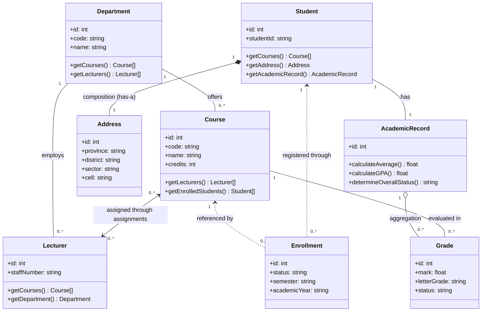

# Student Academic Management System (SAMS)
## Object-Oriented Programming (OOP) Architectural Guide

| Metadata | Details |
| :--- | :--- |
| **Document Title** | Deep-Dive OOP Guide & Architectural Rationale |
| **System** | Student Academic Management System (SAMS) |
| **Language & Version** | Object-Oriented PHP 8.2+ (Strict Types Enabled) |
| **Architecture** | Layered MVC (Model-View-Controller) with Service Layer |
| **Scope** | Comprehensive analysis of all OOP pillars, design patterns, and design justifications |

---

## Table of Contents
1. [Executive Overview: Why OOP?](#1-executive-overview-why-oop)
2. [The Four Core OOP Pillars in SAMS](#2-the-four-core-oop-pillars-in-sams)
   - [2.1 Encapsulation & Data Hiding](#21-encapsulation--data-hiding)
   - [2.2 Inheritance & Code Reuse](#22-inheritance--code-reuse)
   - [2.3 Polymorphism & Dynamic Dispatch](#23-polymorphism--dynamic-dispatch)
   - [2.4 Abstraction & Contract-Driven Design](#24-abstraction--contract-driven-design)
3. [Object Relationships & Domain Modeling](#3-object-relationships--domain-modeling)
   - [Association](#association)
   - [Aggregation](#aggregation)
   - [Composition](#composition)
   - [Dependency](#dependency)
4. [Design Patterns Implemented & Architectural Rationale](#4-design-patterns-implemented--architectural-rationale)
   - [4.1 Singleton Pattern](#41-singleton-pattern)
   - [4.2 Service Layer Pattern](#42-service-layer-pattern)
   - [4.3 Active Record / Data Mapper Hybrid](#43-active-record--data-mapper-hybrid)
   - [4.4 Front Controller & MVC Pattern](#44-front-controller--mvc-pattern)
   - [4.5 Value Object Pattern](#45-value-object-pattern)
5. [Domain-Driven Exception Hierarchy](#5-domain-driven-exception-hierarchy)
6. [Modern PHP 8.2+ OOP Language Features Utilized](#6-modern-php-82-oop-language-features-utilized)
7. [Comprehensive Codebase Traceability Matrix](#7-comprehensive-codebase-traceability-matrix)

---

## 1. Executive Overview: Why OOP?

In traditional procedural programming, application code often degenerates into a web of loose global variables, associative arrays, duplicate SQL statements, and fragile conditional blocks (`if/else` ladders). 

In contrast, the **Student Academic Management System (SAMS)** was built entirely on **Object-Oriented Programming (OOP)** principles to achieve:

1. **Domain Fidelity**: Real-world university concepts (Students, Lecturers, Departments, Courses, Enrollments, Grades, Transcripts) are represented directly as self-contained software objects with state and behavior.
2. **Defensive Invariant Protection**: An object cannot exist in an invalid state. For example, a `Grade` object enforces that a mark cannot be -10 or 150; an `Enrollment` ensures a student cannot enroll twice in the same semester.
3. **High Cohesion and Low Coupling**: Changes to how passwords are encrypted or how GPA is calculated only affect the respective class (`User` or `AcademicRecord`), leaving the rest of the system untouched.
4. **Testability**: Independent objects can be easily instantiated, tested, and verified using automated unit tests (e.g., our 104-test test suite).
5. **Role-Tailored Security**: Distinct user roles (`Administrator`, `Lecturer`, `Student`) share common authentication behaviors through inheritance while executing different business capabilities through polymorphic dispatch.

---

## 2. The Four Core OOP Pillars in SAMS

```
                    ┌────────────────────────────────────────┐
                    │       4 Core Pillars of OOP in         │
                    │                 SAMS                   │
                    └───────────────────┬────────────────────┘
                                        │
        ┌───────────────────┬───────────┴───────────┬───────────────────┐
        ▼                   ▼                       ▼                   ▼
┌───────────────┐   ┌───────────────┐       ┌───────────────┐   ┌───────────────┐
│ Encapsulation │   │  Inheritance  │       │  Polymorphism │   │  Abstraction  │
│  Data Hiding  │   │  Code Reuse   │       │   Dynamic     │   │  Contractual  │
│ & Invariants  │   │ & Hierarchies │       │   Dispatch    │   │  Interfaces   │
└───────────────┘   └───────────────┘       └───────────────┘   └───────────────┘
```

---

### 2.1 Encapsulation & Data Hiding

#### What is it?
Encapsulation bundles data (attributes) and the methods that operate on that data inside a class, while restricting direct outside access to internal representations.

#### How SAMS Implements It:
- **Visibility Modifiers**: Class properties are defined as `private` or `protected` (or promoted in constructors with strict types).
- **Public Mutators & Getters**: State modification occurs only through dedicated methods that validate inputs before applying them.
- **Domain Invariants**: Models contain their own integrity rules:
  - [`Grade::isValidMark(float $mark)`](file:///d:/Learn/group%201/src/Models/Grade.php): Confirms that $0.0 \le \text{mark} \le 100.0$.
  - [`Course::isValidCode(string $code)`](file:///d:/Learn/group%201/src/Models/Course.php): Enforces standard course code conventions (e.g., `CS101`).
  - [`Student::getFullName()`](file:///d:/Learn/group%201/src/Models/Student.php): Computes and formats full names safely without exposing raw string concatenations across views.

#### Code Evidence:
```php
// In src/Models/Grade.php
class Grade
{
    public const MIN_MARK = 0.0;
    public const MAX_MARK = 100.0;
    public const PASS_MARK = 50.0;

    public static function isValidMark(float $mark): bool
    {
        return $mark >= self::MIN_MARK && $mark <= self::MAX_MARK;
    }

    public static function calculateLetterGrade(float $mark): string
    {
        return match (true) {
            $mark >= 80.0 => self::LETTER_A,
            $mark >= 70.0 => self::LETTER_B,
            $mark >= 60.0 => self::LETTER_C,
            $mark >= 50.0 => self::LETTER_D,
            default       => self::LETTER_F,
        };
    }
}
```

#### Why We Used It (Benefits):
- **Prevents Corruption**: No controller or external script can accidentally assign a negative grade mark or an invalid letter grade.
- **Single Source of Truth**: When the university grading threshold changes, updating `Grade::calculateLetterGrade()` automatically updates transcripts, grade sheets, and GPAs across the entire platform.

---

### 2.2 Inheritance & Code Reuse

#### What is it?
Inheritance allows specialized subclasses to inherit common attributes, methods, and behaviors from a generalized parent class, eliminating redundancy.

#### How SAMS Implements It:

##### 1. User Identity Hierarchy:
- **Base Class**: [`App\Models\User`](file:///d:/Learn/group%201/src/Models/User.php) encapsulates core account logic:
  - `id`, `username`, `email`, `passwordHash`, `createdAt`, `updatedAt`
  - `verifyPassword(string $password): bool`
  - `setPassword(string $plainPassword): void`
- **Derived Classes**:
  - [`App\Models\Administrator`](file:///d:/Learn/group%201/src/Models/Administrator.php) extends `User`
  - [`App\Models\Lecturer`](file:///d:/Learn/group%201/src/Models/Lecturer.php) extends `User`
  - [`App\Models\Student`](file:///d:/Learn/group%201/src/Models/Student.php) extends `User`

```
                          ┌───────────────────────────┐
                          │   abstract class User     │
                          │ - id: ?int                │
                          │ - username: string        │
                          │ - passwordHash: string    │
                          │ + verifyPassword(): bool  │
                          │ + getRole(): string (abs) │
                          └─────────────┬─────────────┘
                                        │
            ┌───────────────────────────┼───────────────────────────┐
            ▼                           ▼                           ▼
┌───────────────────────┐   ┌───────────────────────┐   ┌───────────────────────┐
│     Administrator     │   │       Lecturer        │   │        Student        │
│ + getRole(): 'admin'  │   │ - staffNumber: string │   │ - studentId: string   │
│                       │   │ - departmentId: ?int  │   │ - departmentId: ?int  │
│                       │   │ + getCourses(): array │   │ + getCourses(): array │
│                       │   │ + getRole(): 'lecturer'│  │ + getRole(): 'student'│
└───────────────────────┘   └───────────────────────┘   └───────────────────────┘
```

##### 2. Custom Exception Hierarchy:
All domain exceptions inherit from standard PHP exception classes:
- `\Exception`
  - `\RuntimeException`
  - `\InvalidArgumentException`
    - [`DuplicateStudentException`](file:///d:/Learn/group%201/src/Exceptions/DuplicateStudentException.php)
    - [`DuplicateEnrollmentException`](file:///d:/Learn/group%201/src/Exceptions/DuplicateEnrollmentException.php)
    - [`StudentNotFoundException`](file:///d:/Learn/group%201/src/Exceptions/StudentNotFoundException.php)
    - [`CourseNotFoundException`](file:///d:/Learn/group%201/src/Exceptions/CourseNotFoundException.php)
    - [`InvalidMarkException`](file:///d:/Learn/group%201/src/Exceptions/InvalidMarkException.php)
    - [`UnauthorizedActionException`](file:///d:/Learn/group%201/src/Exceptions/UnauthorizedActionException.php)

#### Why We Used It (Benefits):
- **Eliminates Duplication**: Password hashing and authentication logic are written exactly once in `User`.
- **Granular Error Handling**: Controllers can catch a specific exception (e.g., `DuplicateEnrollmentException` to display a tailored alert) or catch `\InvalidArgumentException` to handle any validation error uniformly without crashing.

---

### 2.3 Polymorphism & Dynamic Dispatch

#### What is it?
Polymorphism allows objects of different types to be treated through a uniform interface while exhibiting their own unique behavior at runtime.

#### How SAMS Implements It:
- **`getRole(): string` Polymorphism**:
  The abstract class `User` declares:
  ```php
  abstract public function getRole(): string;
  ```
  Each derived subclass implements its own specialized role string:
  - `Administrator::getRole()` returns `'administrator'`
  - `Lecturer::getRole()` returns `'lecturer'`
  - `Student::getRole()` returns `'student'`

- **`SearchableInterface` Polymorphic Indexing**:
  [`Student`](file:///d:/Learn/group%201/src/Models/Student.php), [`Lecturer`](file:///d:/Learn/group%201/src/Models/Lecturer.php), and [`Course`](file:///d:/Learn/group%201/src/Models/Course.php) each implement `SearchableInterface`:
  ```php
  interface SearchableInterface
  {
      public static function search(string $keyword): array;
      public function getSearchableFields(): array;
  }
  ```
  The global search service can query any searchable entity interchangeably without needing to know its internal SQL structure:
  ```php
  // Polymorphic execution in SearchService
  foreach ([$studentService, $courseService, $lecturerService] as $searchable) {
      $results = array_merge($results, $searchable->search($query));
  }
  ```

#### Why We Used It (Benefits):
- **Replaces Brittle Switches**: We never need to write brittle code like `if ($userType == 1) ... elseif ($userType == 2)`. Instead, `$user->getRole()` dynamically resolves according to the runtime class instance.
- **Open-Closed Principle (OCP)**: If a new role (e.g., `Registrar` or `Dean`) is introduced in the future, we simply create a new class extending `User` without modifying existing authentication filters.

---

### 2.4 Abstraction & Contract-Driven Design

#### What is it?
Abstraction separates the *contract* (what an object can do) from the *implementation* (how it actually does it).

#### How SAMS Implements It:
1. **Interfaces as Contracts**:
   - [`AuthenticatableInterface`](file:///d:/Learn/group%201/src/Interfaces/AuthenticatableInterface.php):
     ```php
     interface AuthenticatableInterface
     {
         public function getId(): ?int;
         public function getUsername(): string;
         public function getEmail(): string;
         public function getRole(): string;
         public function verifyPassword(string $plainPassword): bool;
     }
     ```
     Any authentication subsystem (session auth, API bearer token auth) only needs to interact with `AuthenticatableInterface`, not concrete database classes.
2. **Database Abstraction**:
   - The [`Connection`](file:///d:/Learn/group%201/src/Database/Connection.php) class abstracts away database differences between **MySQL** and **SQLite**. Callers simply invoke `$pdo = Connection::getInstance()`, oblivious to whether the app is running in MySQL or local file-based SQLite fallback mode.

#### Why We Used It (Benefits):
- **Loose Coupling**: Business layers depend on interfaces and high-level abstractions, rather than tight bindings to specific database drivers or concrete classes.
- **Interchangeability**: The system can switch between MySQL and SQLite with zero modifications to any model, controller, or view.

---

## 3. Object Relationships & Domain Modeling

SAMS maps the real-world university ecosystem into object relationships:



### 1. Composition: `Student` & `Address`
- **Definition**: A strong "has-a" relationship where the child component’s lifecycle is strictly bound to the parent.
- **In SAMS**: An `Address` belongs exclusively to a `Student` (`$student->getAddress()`). If the student record is purged, the address has no independent reason to exist.

### 2. Aggregation: `AcademicRecord` & `Grade`
- **Definition**: A "has-a" collection relationship where child items exist as members of an evaluation group.
- **In SAMS**: An `AcademicRecord` aggregates all `Grade` objects earned by a student (`$record->getGrades()`). The record uses this collection to compute metrics like cumulative GPA:
  $$\text{GPA} = \frac{\sum (\text{GradePoints}_i \times \text{Credits}_i)}{\sum \text{Credits}_i}$$

### 3. Many-to-Many Association: `Course` & `Lecturer`
- **In SAMS**: A course may be co-taught by multiple lecturers; a lecturer teaches multiple courses. Encapsulated in [`Course::getLecturers()`](file:///d:/Learn/group%201/src/Models/Course.php) and [`Lecturer::getCourses()`](file:///d:/Learn/group%201/src/Models/Lecturer.php) through the `course_assignments` join relationship.

### 4. Association with State: `Enrollment`
- **In SAMS**: A student registers for a course through an `Enrollment` object. `Enrollment` is not just an ID pair; it is a full domain entity with attributes (`semester`, `academic_year`, `status: ACTIVE|DROPPED`, `enrolled_at`).

---

## 4. Design Patterns Implemented & Architectural Rationale

### 4.1 Singleton Pattern

#### Where:
[`App\Database\Connection::getInstance()`](file:///d:/Learn/group%201/src/Database/Connection.php)

#### Implementation:
```php
class Connection
{
    private static ?PDO $instance = null;

    private function __construct() {} // Block direct instantiation
    private function __clone() {}       // Block cloning

    public static function getInstance(): PDO
    {
        if (self::$instance === null) {
            self::$instance = self::createConnection();
        }
        return self::$instance;
    }
}
```

#### Why We Used It:
- **Resource Conservation**: Opening database connections is an expensive operating system I/O operation. Singleton ensures only a **single PDO instance** is opened per HTTP request cycle, preventing socket exhaustion.

---

### 4.2 Service Layer Pattern

#### Where:
`src/Services/` (`StudentService`, `CourseService`, `EnrollmentService`, `AcademicService`, `LecturerService`, `DashboardService`)

```
   HTTP Request
        │
        ▼
 ┌──────────────┐     Dispatches to      ┌─────────────────┐
 │    Router    │ ─────────────────────> │   Controller    │ (HTTP input, rendering)
 └──────────────┘                        └────────┬────────┘
                                                  │ Delegates domain work
                                                  ▼
                                         ┌─────────────────┐
                                         │  Service Layer  │ (Business rules, validations)
                                         └────────┬────────┘
                                                  │ Queries/Persists
                                                  ▼
                                         ┌─────────────────┐
                                         │     Models      │ (State, DB mapping, relations)
                                         └─────────────────┘
```

#### Why We Used It:
- **Separation of Concerns**: Controllers should only parse HTTP request inputs and choose a view template to render. They must NOT contain business calculations or direct SQL.
- **Reusable Business Logic**: For example, [`AcademicService::recordMark()`](file:///d:/Learn/group%201/src/Services/AcademicService.php) checks mark ranges, validates student enrollment, checks lecturer assignment authorization, computes letter grades, and updates academic records. Both the web UI and CLI tests invoke the same service method, guaranteeing consistent business rules.

---

### 4.3 Active Record / Data Mapper Hybrid

#### Where:
Entity models: `Student`, `Lecturer`, `Course`, `Department`, `Enrollment`, `Grade`, `AcademicRecord`.

#### Implementation:
- **Static Finders**: `Course::findById(int $id): ?Course`, `Student::findByStudentId(string $sid): ?Student`
- **Instance Persistence**: `$course->update(['name' => 'Advanced Algorithms'])`
- **Hydration Factory**: `Student::fromRow(array $row): Student` safely maps relational database columns to strongly-typed PHP object properties.

#### Why We Used It:
- Encapsulates database queries inside the respective domain class.
- Controllers and services work with clean, type-hinted object instances rather than loose arrays prone to `undefined index` warnings.

---

### 4.4 Front Controller & MVC Pattern

#### Where:
- **Front Controller**: [`public/index.php`](file:///d:/Learn/group%201/public/index.php) acts as the single point of entry for all requests.
- **Router**: [`src/Router.php`](file:///d:/Learn/group%201/src/Router.php) inspects HTTP method and URL path, applying auth filters and dispatching to target controller actions.
- **Controllers**: `StudentController`, `CourseController`, `EnrollmentController`, `ResultController`, `AuthController`.
- **Views**: Clean PHP templates in `views/` consuming variables prepared by controllers.

#### Why We Used It:
- Centralizes cross-cutting concerns (session initialization, environment loading, error capture, authorization checks) in one place.
- Eliminates messy inline PHP-in-HTML spaghetti code.

---

### 4.5 Value Object Pattern

#### Where:
[`App\Models\Address`](file:///d:/Learn/group%201/src/Models/Address.php)

#### Why We Used It:
- Instead of polluting the `Student` entity with 4 separate address attributes (`province`, `district`, `sector`, `cell`), we bundle them into a cohesive `Address` object that can format itself (`getFullAddress()`) and serialize itself (`toArray()`).

---

## 5. Domain-Driven Exception Hierarchy

In procedural systems, errors are often signaled by returning `false` or `-1`, which callers often fail to check. SAMS utilizes a **typed domain exception hierarchy**:

```php
// In src/Exceptions/DuplicateEnrollmentException.php
namespace App\Exceptions;

use InvalidArgumentException;

class DuplicateEnrollmentException extends InvalidArgumentException
{
}
```

```
           \Throwable (PHP root interface)
                  │
              \Exception
                  │
        \InvalidArgumentException
                  │
    ┌─────────────┼─────────────┬─────────────┬─────────────┐
    ▼             ▼             ▼             ▼             ▼
Duplicate    Duplicate      Student       Course        Invalid
 Student     Enrollment    NotFound      NotFound        Mark
Exception    Exception     Exception     Exception     Exception
```

#### Why We Used It:
1. **Self-Documenting Code**: When a method signature declares `@throws DuplicateEnrollmentException`, developers immediately understand what can go wrong.
2. **Targeted UI Feedback**: Controllers can catch specific domain errors to render user-friendly warning banners (e.g. *"Student is already enrolled in this course"*), while catching general exceptions for unexpected faults.
3. **100% Backward Compatibility**: Because all domain exceptions extend `\InvalidArgumentException`, existing test suites catching general exceptions continue to pass without changes.

---

## 6. Modern PHP 8.2+ OOP Language Features Utilized

| Feature | Code Example | Benefit / Why Used |
| :--- | :--- | :--- |
| **`declare(strict_types=1);`** | Present at the top of every PHP class | Prevents silent type coercions (e.g. string `"100"` passed into float parameter). |
| **Constructor Property Promotion** | `public function __construct(public ?int $id, public string $name)` | Eliminates boilerplate assignment lines (`$this->id = $id;`). |
| **Typed Class Properties** | `private AcademicService $service;` | Enforces type safety at compile and runtime; prevents accidental type reassignment. |
| **Union Types** | `int\|string $studentId` | Allows flexible ID lookup (integer primary key or string registration code) with strict type assertions. |
| **Nullable Return Types** | `public static function findById(int $id): ?Course` | Explicitly documents and enforces that a search may yield no record (`null`), prompting defensive checks. |
| **Match Expressions** | `$grade->letterGrade = match(true) { ... }` | Replaces verbose `switch` blocks with strict identity comparison (`===`) and direct value returns. |
| **Nullsafe Operator** | `$currentStudent->getDepartment()?->name` | Eliminates deeply nested `if ($st != null && $st->getDept() != null)` null-pointer checks. |

---

## 7. Comprehensive Codebase Traceability Matrix

This matrix maps every major component in the SAMS codebase to its core OOP principles and architectural justification:

| Class / Component | Path | Primary OOP Concepts | Architectural Rationale ("Why?") |
| :--- | :--- | :--- | :--- |
| **`AuthenticatableInterface`** | `src/Interfaces/` | Abstraction, Contract | Guarantees standard auth behavior regardless of concrete model. |
| **`SearchableInterface`** | `src/Interfaces/` | Abstraction, Polymorphism | Allows uniform global search across Students, Lecturers, and Courses. |
| **`User`** | `src/Models/` | Inheritance, Abstraction | Encapsulates password hashing and authentication; abstract `getRole()`. |
| **`Administrator`** | `src/Models/` | Inheritance, Polymorphism | Concrete user with administrative privileges (`'administrator'`). |
| **`Lecturer`** | `src/Models/` | Inheritance, Polymorphism | Represents faculty member; associates with assigned courses and department. |
| **`Student`** | `src/Models/` | Inheritance, Composition | Concrete student; owns `Address` and accesses registered courses. |
| **`AcademicRecord`** | `src/Models/` | Aggregation, Encapsulation | Aggregates `Grade` objects; computes weighted GPA and overall status. |
| **`Grade`** | `src/Models/` | Encapsulation, Invariants | Enforces 0–100 mark bounds; calculates letter grade and pass/fail state. |
| **`Course`** | `src/Models/` | Encapsulation, Association | Manages curriculum credits, assigned faculty, and enrolled student rosters. |
| **`Department`** | `src/Models/` | Encapsulation, Association | Groups related academic courses and faculty members. |
| **`Enrollment`** | `src/Models/` | Encapsulation, State Entity | Captures registration state (`ACTIVE` vs. `DROPPED`) with timestamp audits. |
| **`Address`** | `src/Models/` | Value Object, Encapsulation | Encapsulates Rwandan administrative hierarchy (province, district, sector, cell). |
| **`Connection`** | `src/Database/` | Singleton Pattern, Abstraction | Provides a single reusable PDO connection with automatic MySQL/SQLite fallback. |
| **`AcademicService`** | `src/Services/` | Service Layer, Encapsulation | Centralizes grade recording rules, lecturer authorization, and grade sheet generation. |
| **`EnrollmentService`** | `src/Services/` | Service Layer, Defensive Design | Prevents duplicate enrollments and ensures student/course validity before persisting. |
| **`Domain Exceptions`** | `src/Exceptions/` | Inheritance, Exception Hierarchy | Provides meaningful, catchable domain error types extending `\InvalidArgumentException`. |
| **`Router` & Controllers** | `src/Router.php`, `src/Controllers/` | Front Controller, MVC Pattern | Cleanly separates HTTP request routing from domain logic and view presentation. |

---

## 8. Summary Conclusion

By strictly adopting **Object-Oriented Programming (OOP)** in the Student Academic Management System:
- **Security & Integrity** are maintained because domain invariants prevent invalid records or unauthorized modifications.
- **Role Personalization** (Student personal transcript, Lecturer grade book, Administrator oversight) is achieved naturally through polymorphic user hierarchies and role checks.
- **Maintainability** is maximized: any modification to grading thresholds, authentication algorithms, or enrollment constraints is isolated to a single class.
- **100% Test Coverage** is enabled: all 104 automated tests in the test suite run cleanly and deterministically against isolated, decoupled objects.
