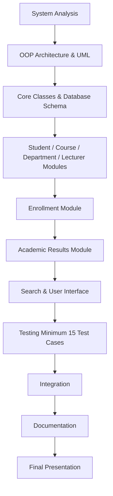

# Student Academic Management System (SAMS)
## System Requirements Document

| Metadata | Details |
| :--- | :--- |
| **Project** | Student Academic Management System |
| **Group** | Group 1 |
| **Technology** | Object-Oriented PHP |
| **Database** | MySQL |
| **Document** | System Requirements |
| **Role** | System Analyst / Project Lead |
| **Version** | 1.0 |

---

## 1. Introduction
The **Student Academic Management System (SAMS)** is an Object-Oriented PHP application designed to manage student academic information, courses, departments, lecturers, course enrollment, and academic results.

The system replaces manual academic record management with a centralized system that allows authorized users to manage and retrieve academic information efficiently.

The system will demonstrate Object-Oriented Programming (OOP) concepts including:
- Classes and Objects
- Encapsulation
- Inheritance
- Abstraction
- Polymorphism
- Interfaces
- Constructors
- Destructors
- Static properties and methods
- Exception handling
- Error handling

---

## 2. Problem Statement
The institution currently manages student information, courses, course registration, and academic results manually.

This approach creates several problems:
- Difficulty maintaining accurate student records.
- Difficulty retrieving student information.
- Time-consuming course registration.
- Difficulty tracking registered courses.
- Difficulty recording and updating academic marks.
- Difficulty calculating student averages.
- Increased possibility of duplicate or incorrect records.
- Difficulty searching for students and courses.
- Limited control over who can modify academic results.

Therefore, a computerized Student Academic Management System is required to centralize and simplify academic management.

---

## 3. Proposed Solution
The proposed system will provide a centralized academic management platform where:
- Students can manage their personal information.
- Students can register for and drop courses.
- Students can view their registered courses.
- Lecturers can record and update marks.
- Authorized users can view academic results.
- The system can calculate student averages.
- The system can determine pass/fail status.
- Administrators can manage students, courses, departments, and lecturers.
- Users can search for students and courses.
- Academic records can be stored and retrieved efficiently.

---

## 4. Objectives

### 4.1 General Objective
To design and develop an Object-Oriented PHP-based Student Academic Management System that efficiently manages student academic information, course registration, and academic results.

### 4.2 Specific Objectives
The system aims to:
- Register and maintain student information.
- Allow students to update and view their personal information.
- Manage departments.
- Manage courses.
- Manage lecturer information.
- Allow students to register for courses.
- Allow students to drop registered courses.
- Display courses registered by a student.
- Record student academic marks.
- Update student academic marks when authorized.
- Calculate student average marks.
- Determine student pass/fail status.
- Search students by student ID or name.
- Search courses by course code.
- Find students registered for a particular course.
- Apply authentication and role-based access.
- Demonstrate Object-Oriented Programming principles.
- Provide proper validation and error handling.

---

## 5. Scope

### 5.1 In Scope
The system will cover:
- **Student Management**: Student registration, profile management, viewing student information, updating student information, and student search.
- **Department Management**: Creating departments, viewing departments, updating departments, and managing department relationships with students and courses.
- **Course Management**: Creating courses, viewing courses, updating courses, assigning courses to departments, assigning lecturers to courses, and searching courses by code.
- **Lecturer Management**: Registering lecturers, viewing lecturer information, assigning lecturers to courses, and recording marks.
- **Enrollment Management**: Registering students for courses, viewing registered courses, dropping courses, and preventing duplicate enrollment.
- **Academic Results**: Recording marks, updating marks, viewing marks, calculating averages, determining pass/fail status, and maintaining academic records.
- **Search Capabilities**:
  - Student search by ID.
  - Student search by name.
  - Course search by code.
  - Search for students registered in a course.

### 5.2 Out of Scope
The following are outside the minimum scope of this project:
- Online payment processing.
- Library management.
- Hostel management.
- Payroll management.
- Staff attendance management.
- Full learning management system functionality.
- Online examination delivery.

---

## 6. System Stakeholders

| Stakeholder | Main Responsibilities |
| :--- | :--- |
| **Student** | Manage profile, register/drop courses, view registered courses and academic results. |
| **Lecturer** | Record and update student marks, view academic information for assigned courses. |
| **Administrator** | Manage students, lecturers, courses, departments, and overall system configuration. |
| **Institution** | Use the system to manage academic information efficiently and securely. |

---

## 7. User Roles
The system will contain three main user types:

### 7.1 Student
A student can:
- Log into the system.
- View personal information.
- Update personal information.
- Register for courses.
- Drop courses.
- View registered courses.
- View academic results.

### 7.2 Lecturer
A lecturer can:
- Log into the system.
- View assigned courses.
- View students registered for assigned courses.
- Record marks.
- Update marks.
- View student academic results where authorized.

### 7.3 Administrator
An administrator can:
- Manage students.
- Manage lecturers.
- Manage courses.
- Manage departments.
- View academic information.
- Search academic records.
- Perform administrative operations.

---

## 8. Functional Requirements

- **FR-01: User Authentication**
  - The system shall allow users to log in using valid credentials.
  - The system shall validate login credentials, identify the user's role, provide access according to the user's role, and reject invalid credentials.

- **FR-02: Student Registration**
  - The system shall allow an administrator to register a student.
  - Student information may include: Student ID, Full name, Email, Date of birth, Programme, Department, Address.
  - The system shall prevent duplicate student IDs.

- **FR-03: View Student Information**
  - The system shall allow authorized users to view student information.
  - A student shall be able to view their own profile.
  - Administrators shall be able to view student records.

- **FR-04: Update Student Information**
  - The system shall allow authorized users to update student information.
  - The system shall validate updated information before saving it.

- **FR-05: Department Management**
  - The system shall allow administrators to create, view, and update departments.
  - Associate students with departments, courses with departments, and lecturers with departments.

- **FR-06: Course Management**
  - The system shall allow administrators to create, view, and update courses.
  - Assign courses to departments and assign lecturers to courses.
  - Each course shall have a unique course code.

- **FR-07: Lecturer Management**
  - The system shall allow administrators to register lecturers, view lecturers, update lecturer information, associate lecturers with departments, and assign lecturers to courses.

- **FR-08: Course Registration**
  - The system shall allow students to register for available courses.
  - The system shall verify that the student exists, verify that the course exists, prevent duplicate enrollment, and store enrollment information.

- **FR-09: Course Drop**
  - The system shall allow students to drop an active course enrollment.
  - The system shall ensure that only valid active enrollments can be dropped.

- **FR-10: View Registered Courses**
  - The system shall allow students to view their currently registered courses.
  - The displayed information may include: Course code, Course name, Credit hours, Lecturer, Enrollment status.

- **FR-11: Record Academic Marks**
  - Authorized lecturers shall be able to record marks for students registered in their courses.
  - The system shall validate marks before storing them.

- **FR-12: Update Academic Marks**
  - Authorized users shall be able to update previously recorded marks.
  - The system shall ensure that unauthorized users cannot modify academic results.

- **FR-13: View Academic Results**
  - Authorized users shall be able to view academic results.
  - Students shall be able to view their own academic results.
  - Lecturers shall be able to view results related to their assigned courses.
  - Administrators shall have appropriate administrative access.

- **FR-14: Calculate Average**
  - The system shall calculate a student's average mark from the applicable academic results.
  - The calculation shall be performed by the academic record functionality rather than manually by the user.

- **FR-15: Determine Pass/Fail**
  - The system shall determine whether a student has passed or failed based on the configured academic pass criteria.
  - The result status shall be generated from the student's marks.

- **FR-16: Student Search**
  - The system shall allow authorized users to search for students using Student ID or Student name.

- **FR-17: Course Search**
  - The system shall allow authorized users to search for courses using the course code.

- **FR-18: Course Enrollment Search**
  - The system shall allow authorized users to find students registered for a particular course.

---

## 9. Non-Functional Requirements

### 9.1 Usability
- The system should provide a simple and understandable interface.
- Users should be able to perform common operations with minimal difficulty.

### 9.2 Security
- Protect user credentials.
- Restrict operations according to user roles.
- Prevent unauthorized modification of academic results.
- Validate user input.
- Protect sensitive academic information.

### 9.3 Maintainability
- The system shall use Object-Oriented Programming principles to make the source code modular, reusable, organized, easier to maintain, and easier to extend.

### 9.4 Reliability
- The system should maintain consistent academic records and prevent invalid operations such as:
  - Duplicate student registration.
  - Duplicate course enrollment.
  - Invalid marks.
  - Updating nonexistent records.

### 9.5 Performance
- The system should retrieve student, course, enrollment, and academic information within a reasonable amount of time.

### 9.6 Scalability
- The system architecture should allow additional functionality to be added without significantly changing existing modules.

---

## 10. Business Rules

- **BR-01: Unique Student ID**: Every student must have a unique student ID.
- **BR-02: Unique Course Code**: Every course must have a unique course code.
- **BR-03: Valid Student**: Only registered students can register for courses.
- **BR-04: Valid Course**: A student can only register for an existing course.
- **BR-05: No Duplicate Enrollment**: A student cannot register for the same course more than once while an active enrollment exists.
- **BR-06: Course Drop**: A student can only drop a course in which they are currently enrolled.
- **BR-07: Valid Marks**: Marks must fall within the configured valid academic range.
- **BR-08: Authorized Marks**: Only authorized users can record or update academic marks.
- **BR-09: Academic Record**: Academic records must be associated with the correct student.
- **BR-10: Course Relationship**: Courses must belong to a valid department.
- **BR-11: Lecturer Assignment**: A course may be assigned to an appropriate lecturer.
- **BR-12: Role-Based Access**: Users can only perform operations permitted for their role.
- **BR-13: Data Validation**: Required information must be validated before being stored.

---

## 11. Main System Entities
The system shall contain at least the following meaningful classes:
- `User`
- `Student`
- `Lecturer`
- `Administrator`
- `Course`
- `Department`
- `Enrollment`
- `Grade`
- `AcademicRecord`
- `Address`

---

## 12. Preliminary Relationships

```text
User
 ├── Student
 ├── Lecturer
 └── Administrator

Student
 ├── Address
 ├── Enrollment
 └── AcademicRecord

Enrollment
 ├── Student
 └── Course

AcademicRecord
 └── Grade

Course
 ├── Department
 └── Lecturer

Department
 ├── Student
 ├── Lecturer
 └── Course
```

---

## 13. OOP Requirements
The system must demonstrate the following OOP concepts:

### 13.1 Class
The system shall use classes to represent entities such as:
- `Student`
- `Course`
- `Lecturer`
- `Enrollment`
- `Grade`

### 13.2 Object
The application shall create multiple objects from the defined classes.
```php
$student = new Student(...);
$course = new Course(...);
```

### 13.3 Encapsulation
Class properties should be protected using appropriate access modifiers (`private`, `protected`).
```php
private string $studentId;
private string $name;
```
Data should be accessed through appropriate getter and setter methods.

### 13.4 Inheritance
The system shall use inheritance for different user types:
```text
User
 ├── Student
 ├── Lecturer
 └── Administrator
```

### 13.5 Abstraction
An abstract `User` class shall define common user behavior while allowing subclasses to implement role-specific behavior.

### 13.6 Polymorphism
Different user classes shall be able to implement common methods differently.
For example, `getRole()` may return:
- `Student`
- `Lecturer`
- `Administrator`
depending on the object type.

### 13.7 Interface
An interface may be used to define common behavior that must be implemented by selected classes (e.g., `SearchableInterface`, `AuthenticatableInterface`, `RenderableInterface`).

### 13.8 Constructor
Constructors (`__construct()`) shall initialize objects when they are created.

### 13.9 Destructor
A destructor (`__destruct()`) may be used where appropriate for object cleanup (e.g., closing database connections or logging session completion).

### 13.10 Static Property/Method
Static members may be used for shared functionality such as counters, database connection instances (Singleton), or utility/validation operations where appropriate.

### 13.11 Exception Handling
The system shall use exceptions to handle exceptional situations such as:
- Invalid student information.
- Duplicate enrollment.
- Invalid marks.
- Missing records.
- Unauthorized operations.

---

## 14. Validation Requirements
The system shall validate:
- Required fields.
- Email format.
- Unique student ID.
- Unique course code.
- Valid marks (range checking).
- Existing student records.
- Existing course records.
- Duplicate enrollment prevention.
- User permissions.

*Invalid input shall not be stored in the database.*

---

## 15. Error Handling
The application shall provide meaningful error messages when operations fail, including:
- *"Student ID already exists."*
- *"Course not found."*
- *"Student is already enrolled in this course."*
- *"Invalid mark. Mark must be within the allowed range."*
- *"You are not authorized to update this result."*
- *"Student record not found."*

The system should avoid exposing sensitive technical information such as database credentials or internal stack traces to normal users.

---

## 16. Testing Requirements
The system shall be tested using at least 15 test cases covering:
1. User login.
2. Invalid login.
3. Student registration.
4. Duplicate student registration.
5. Student profile update.
6. Student search.
7. Course creation.
8. Course search.
9. Course registration.
10. Duplicate course enrollment.
11. Course drop.
12. Record marks.
13. Invalid marks.
14. Update marks.
15. Calculate average.
16. Determine pass/fail.
17. Unauthorized result modification.
18. Search students by course.

---

## 17. Development Dependencies



---

## 18. GitHub Collaboration Requirements
The project shall use GitHub for collaborative development.

### Recommended Branches:
- `main`
- `develop`
- `feature/student-management`
- `feature/course-management`
- `feature/enrollment`
- `feature/academic-results`
- `feature/ui-search`

### Team Workflow:
1. Create a feature branch from `develop`.
2. Implement assigned functionality.
3. Test changes thoroughly.
4. Commit using meaningful commit messages.
5. Push the branch to GitHub.
6. Create a Pull Request (PR).
7. Review the changes with team members.
8. Merge into `develop`.
9. Direct development on `main` should be avoided.

---

## 19. Success Criteria
The system will be considered successful if:
- Students can be registered and managed.
- Courses can be created and managed.
- Departments and lecturers can be managed.
- Students can register for and drop courses.
- Registered courses can be viewed.
- Academic marks can be recorded and updated by authorized users.
- Academic averages can be calculated automatically.
- Pass/fail status can be determined based on criteria.
- Students and courses can be searched.
- At least 8 meaningful OOP classes are implemented.
- OOP concepts are clearly demonstrated.
- The application handles errors appropriately.
- At least 15 test cases are completed.
- UML and technical documentation are provided.

---

## 20. Conclusion
The **Student Academic Management System** will provide a structured solution for managing student academic information, course registration, and academic results.

The requirements defined in this document serve as the foundation for the system architecture, UML design, implementation, testing, and final technical report. The development team should use these requirements as the baseline when designing and implementing the application.
